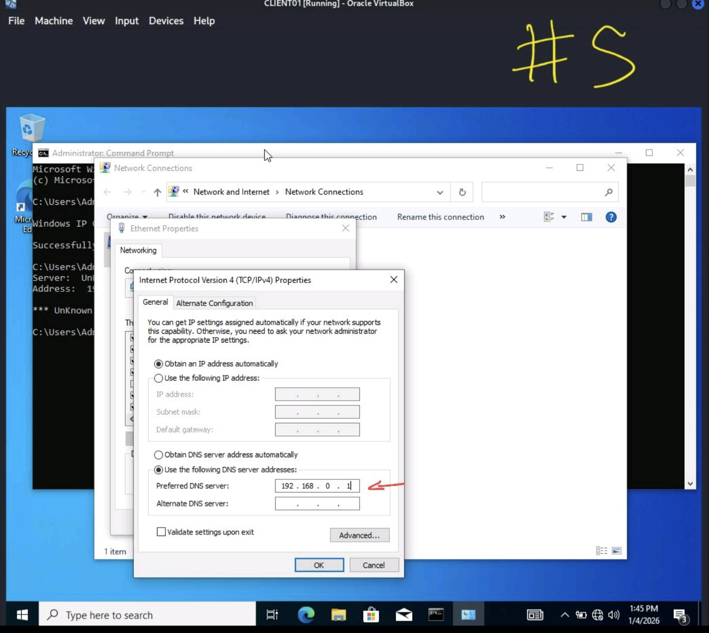
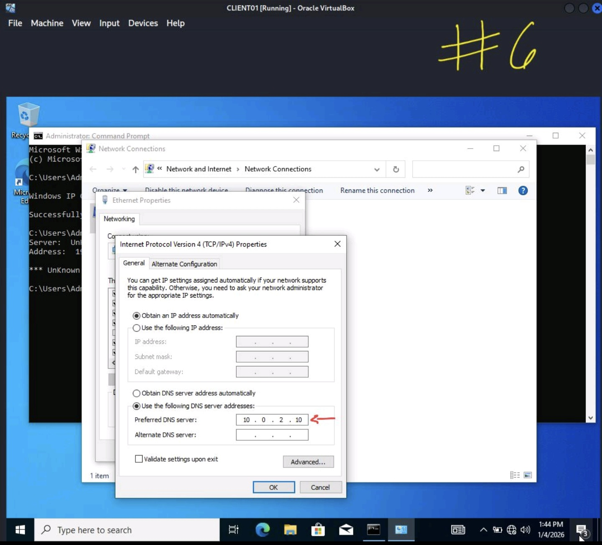
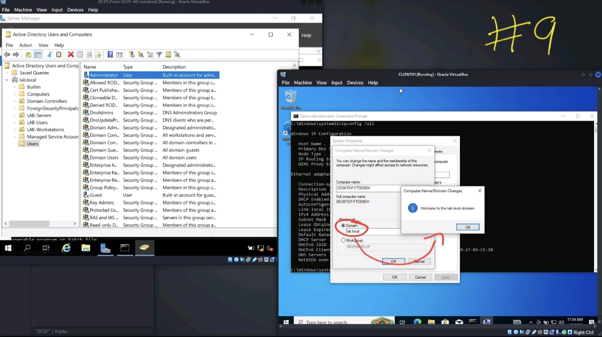

# AD-Domain-Join-DNS-Troubleshooting
Tier-1 helpdesk lab documenting an Active Directory domain join failure caused by DNS misconfiguration, including troubleshooting, root cause analysis, resolution, and validation.

### 01 – IP Configuration Baseline

### 02 – DNS Lookup Failure

### 03 – Network Access Confirmed

### 04 – IPv4 DNS Settings

### 05 – DNS Misconfiguration Identified

### 06 – DNS Corrected

### 07 – IP Configuration Verified

### 08 – Firewall / Connectivity Check

### 09 – Successful Domain Join

### 10 – Post-Join Validation

---

## 📸 Screenshots – Troubleshooting Flow
